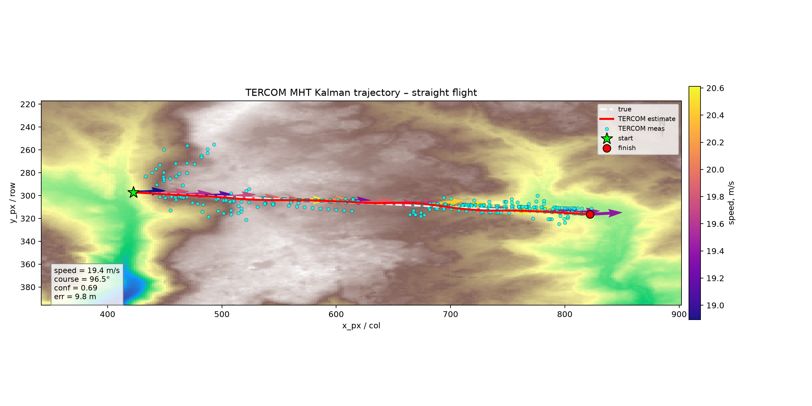
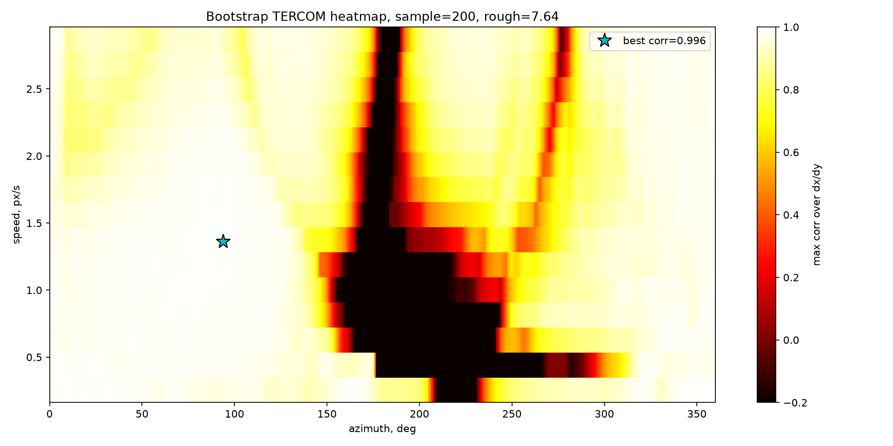
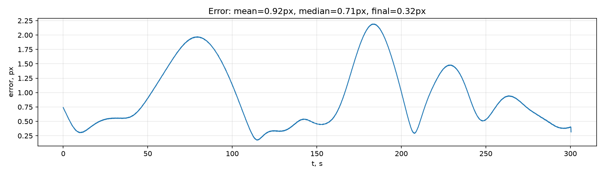

# Полёт вслепую — навигация по рельефу без GPS

Определение координат, скорости и курса воздушного судна **без спутниковой навигации** (GPS/ГЛОНАСС) —
по форме земли под крылом. Если спутниковый сигнал заглушили или потеряли, самолёт всё равно должен
понимать, где он. Решение читает «рельеф под собой» и находит это место на заранее загруженной карте.

Метод называется **TERCOM** (Terrain Contour Matching — сопоставление профиля рельефа).

---

## Идея простыми словами

У самолёта есть два прибора:

- **радиовысотомер** — измеряет расстояние до земли прямо под собой (сколько метров «вниз»);
- **барометр** — измеряет абсолютную высоту полёта над уровнем моря.

Вычитаем одно из другого и получаем **высоту самого рельефа** в каждой точке маршрута:

```
высота земли над морем = высота полёта (барометр) − расстояние до земли (радиовысотомер)
```

Пролетая, мы собираем **профиль высот** — что-то вроде «кардиограммы» местности: холм, низина, склон.
Этот профиль уникален, как отпечаток. Дальше мы берём **карту высот** того района (DEM — Digital
Elevation Model, обычная матрица «высота в каждой точке») и ищем на ней такую линию, чей рельеф
совпадает с нашим отпечатком. Где совпало — там мы и летим.

Сравнение «похоже / не похоже» — это **корреляция**: математическая мера того, насколько две линии
повторяют форму друг друга (1.0 — идеально совпали, 0 — ничего общего).

Сложность в том, что заранее **неизвестны ни скорость, ни направление** полёта. Поэтому алгоритм
сначала перебирает множество вариантов «куда и как быстро мы могли лететь» от последней известной
точки, отбирает самые правдоподобные, а затем **ведёт** объект дальше, уточняя позицию на каждом шаге.

---

## Что реально готово: движок TERCOM (папка `Тигран/`)

Это законченное, рабочее ядро проекта. Один самодостаточный скрипт
[`Тигран/tercom_final.py`](Тигран/tercom_final.py), которому нужны только карта высот и записанный
профиль радиовысотомера.

Как он работает по шагам:

1. **Подготовка сигнала.** Сырые показания приборов шумят (вибрация двигателя, болтанка). Их чистят
   фильтрами: медианный (убирает резкие выбросы) + сглаживающий фильтр низких частот, а барометр
   дополнительно стабилизирует фильтр Калмана (предсказывает следующее значение и подмешивает к нему
   измерение, гася шум).
2. **Первичный захват («бутстрап»).** От последней точки GPS перебираются сотни гипотез «направление ×
   скорость» и для каждой строится предполагаемый профиль рельефа с карты. Совпавшие по корреляции —
   кандидаты. Чтобы не схватить случайно похожее «чужое» место, кандидатов перепроверяют на нескольких
   длинах участка (ложное совпадение обычно разваливается на длинном окне).
3. **Сопровождение.** После захвата объект ведут дальше **фильтром Калмана** (математический «следящий
   глаз»: держит позицию и скорость, плавно поправляя их по новым измерениям). Чтобы один ошибочный
   замер не сбил трек, ведётся **несколько гипотез одновременно** (multi-hypothesis) — выживает самая
   достоверная.
4. **Финальная доводка.** Уже после прохода трек дополнительно «защёлкивают» на лучшие совпадения
   рельефа и сглаживают. Эти поправки **не вмешиваются обратно** в основной алгоритм (чтобы не
   раскачать его) и ограничены порогами, чтобы не «дорисовывать» данные там, где рельеф неоднозначен.

На выходе — папка с результатами: траектория в пикселях и в реальных координатах (широта/долгота,
скорость в м/с, курс в градусах), графики и HTML-отчёт.



Как выглядит сам перебор гипотез на этапе захвата — ниже. По горизонтали направление полёта (азимут,
0–360°), по вертикали скорость, цвет — насколько хорошо совпал рельеф (светлее = лучше). Алгоритм
находит чёткий максимум (звёздочка, корреляция 0.996) — это и есть верный ответ «куда и как быстро мы
летим». Тёмная зона — направления, где рельеф под нами с картой не совпадает.



### Точность

На тестовом маршруте над сибирской тайгой (карта ~30 м на пиксель):

| Показатель | Результат |
|---|---|
| Финальная ошибка позиции | **≈ 10 м** (меньше половины пикселя карты) |
| Медианная ошибка по треку | **≈ 16 м** |

Это близко к **физическому пределу** для таких данных (~11 м): точнее не позволяют ни разрешение
карты, ни шум радиовысотомера, ни принципиально «похожие на чужие» участки рельефа над безориентирной
местностью. Подробный разбор — в [`Тигран/ОТЧЁТ_точность.md`](Тигран/ОТЧЁТ_точность.md).

Ниже — ошибка положения на протяжении всего полёта (в пикселях карты). Весь маршрут она держится
**меньше одного-двух пикселей**, то есть точность стабильна, а не «повезло в одной точке».



**Честность результата:** истинная траектория алгоритму **не показывается** — она нужна только чтобы
посчитать ошибку на графиках. Старт берётся из последнего GPS-сигнала (он легитимно есть до пропадания),
курс — из «компаса». Если задать заведомо неверный курс, результат почти не меняется — значит система
действительно восстанавливает путь по рельефу, а не «подгоняет под ответ».

### Как запустить

```bash
pip install numpy scipy matplotlib rasterio tifffile

cd Тигран
python tercom_final.py --dem dem_package_sibir.txt --heights heights_m.txt --input-mode radio \
  --start-x 422 --start-y 297 --initial-heading-deg 95 --truth tchk.csv --refit --out-dir result
```

Обязателен только `numpy`; остальные библиотеки опциональны (без них просто отключаются графики или
часть форматов карт). Результаты появятся в папке `result/`.

---

## Вспомогательные части (наброски и эксперименты)

Эти папки — подготовка данных и исследовательские прототипы. Они помогали прийти к финальному решению,
но это **черновики**, а не готовый продукт:

- **`траектория/`** — программа с окошком (GUI): открываешь карту высот, кликами рисуешь маршрут, она
  считает длину/азимут и сохраняет «эталонную» траекторию. Нужна, чтобы готовить тестовые данные.
  Внутри есть `архив (мусор)/` — отброшенные ранние версии.
- **`Егор/`** — генератор реалистичного шумного сигнала радиовысотомера из эталонной траектории
  (имитирует вибрацию, турбулентность, выбросы) и эксперименты с фильтрами. Подпапка
  `для тигра клодовича/final/` — **копия** финального решения из `Тигран/`.
- **`Александр/`** — отдельные реализации фильтров высоты (медиана + Калман) и генераторов помех.
- **`парсинг данных и вычисление высоты рельефа/`** — учебная/референсная реализация разбора
  NMEA-сообщений радиовысотомера и расчёта высоты рельефа (на Python и C++).

> Примечание: в финальном конвейере вся фильтрация уже встроена в `tercom_final.py`, поэтому отдельные
> фильтры из этих папок дублируют его и нужны больше для понимания принципа.

Техническое задание — в PDF в корне репозитория (`Описание первичное.pdf`, `Расширенное описание.pdf`).

---

## Краткий словарь терминов

- **TERCOM** — навигация сопоставлением профиля рельефа с картой высот.
- **DEM** — цифровая карта высот (матрица «высота в каждой точке местности»).
- **Радиовысотомер** — прибор, меряющий расстояние от самолёта до земли под ним.
- **NMEA / GPGGA** — текстовый формат, в котором приборы выдают свои данные строками.
- **Корреляция** — числовая мера схожести формы двух кривых (здесь: профиля под нами и участка карты).
- **Фильтр Калмана** — алгоритм, который сглаживает шумные измерения, предсказывая следующее состояние.
